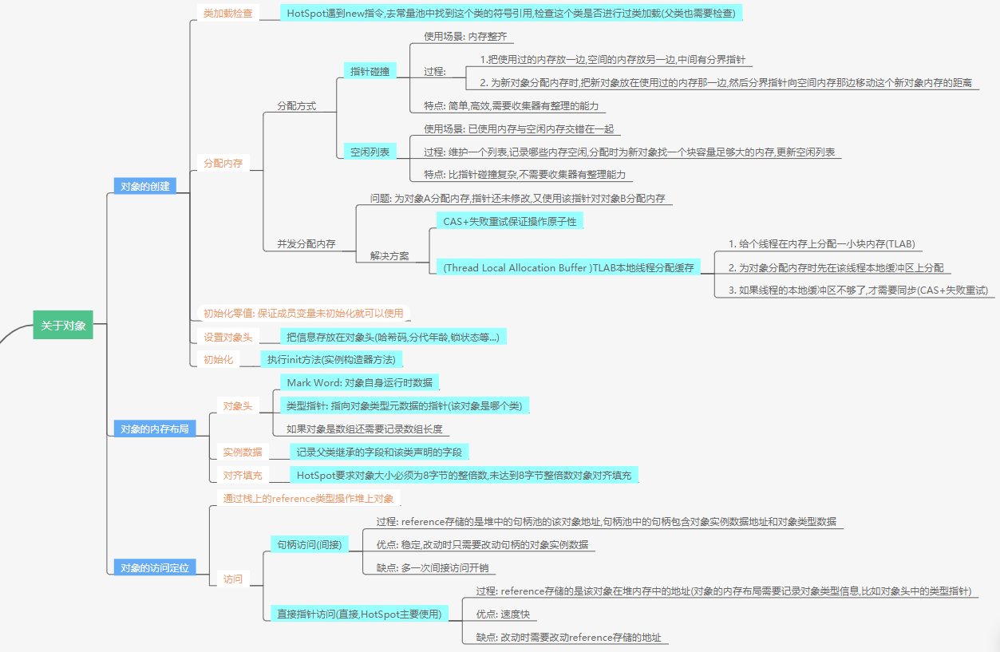
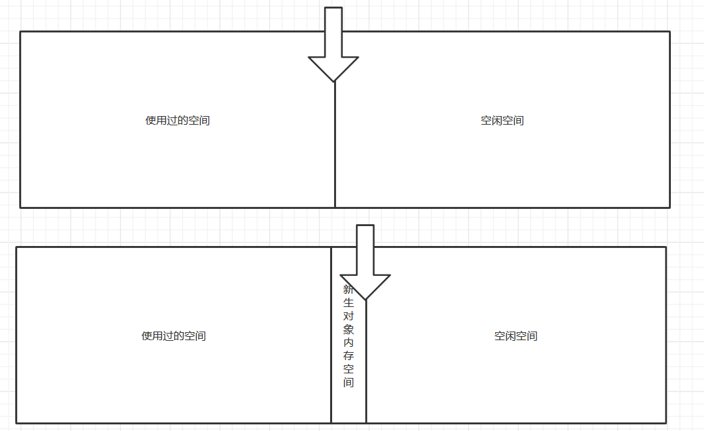
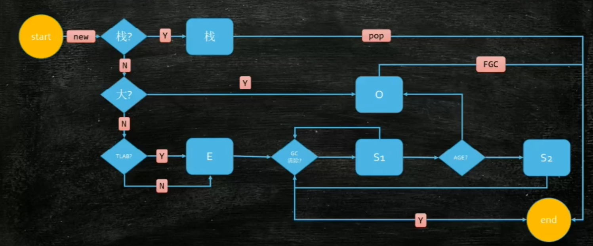
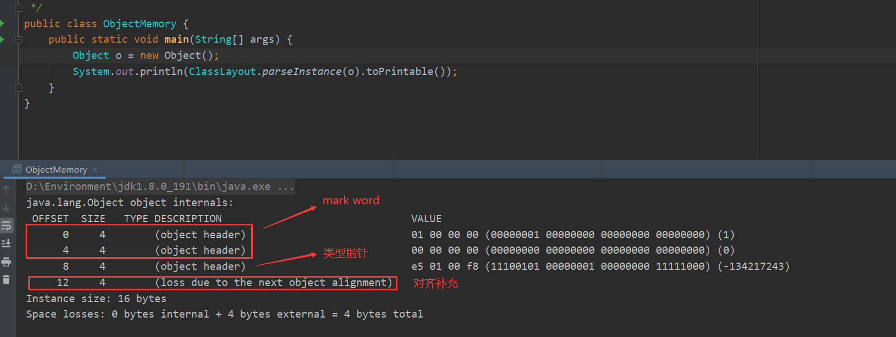
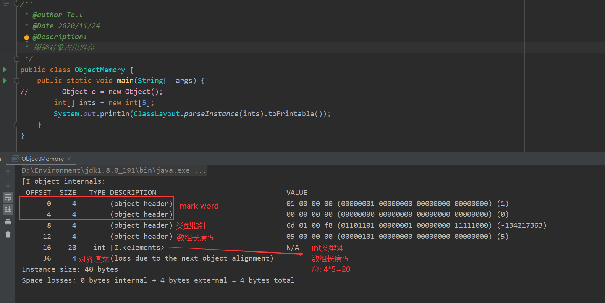
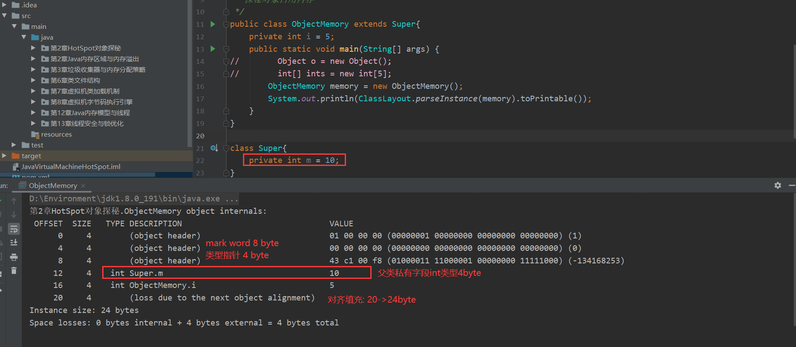
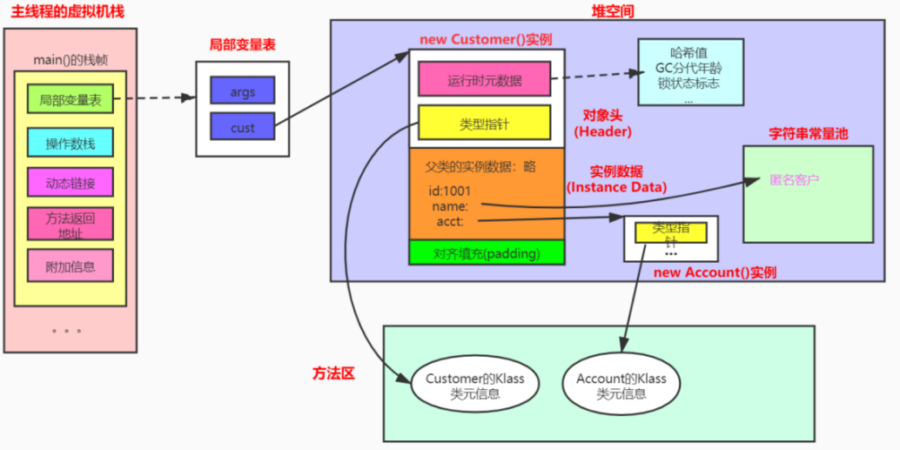
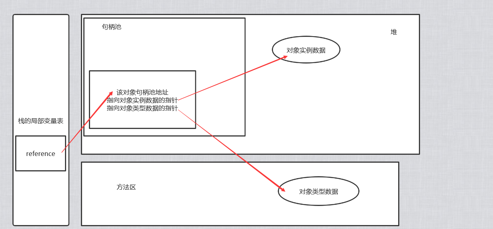
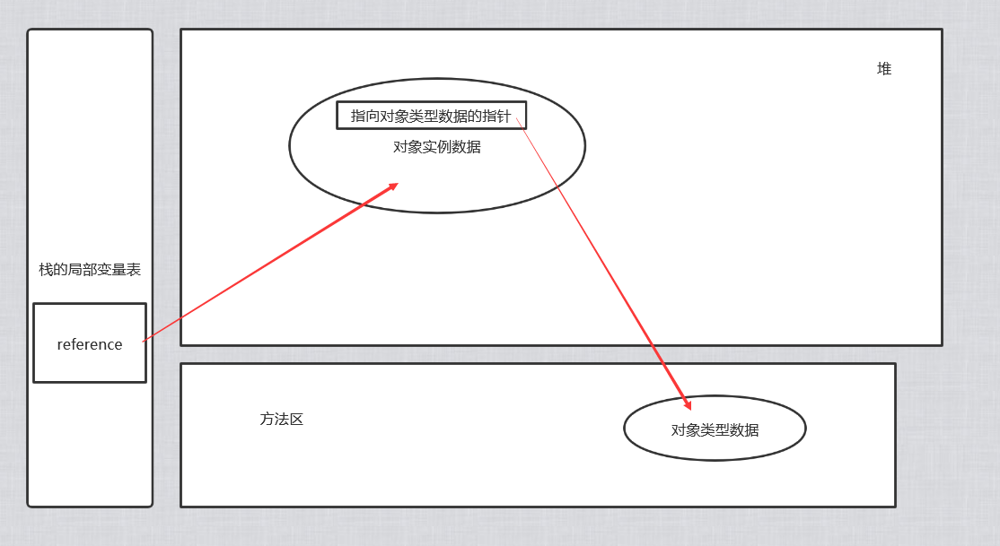

[toc]


## HotSpot虚拟机对象探秘



### 对象的创建

对象的创建可以分为五个步骤:**检查类加载,分配内存,初始化零值,设置对象头,执行实例构造器<init>**

#### 类加载检查

- **HotSpot虚拟机遇到一条new指令,会先检查能否在常量池中定位到这个类的符号引用,检查这个类是否类加载过**
	- 没有类加载过就去类加载
	- 类加载过就进行下一步分配内存


#### 分配内存

  **对象所需的内存在类加载完成后就可以完全确定**

##### 分配内存方式

  虚拟机在堆上为新对象分配内存,有两种内存分配的方式:**指针碰撞,空闲列表**

  - 指针碰撞

    - 使用场景: 堆内存规整整齐

    - 过程: 使用过的空间放在一边,空闲的空间放在另一边,中间有一个指针作为分界点指示器,把新生对象放在使用过空间的那一边,中间指针向空闲空间那边挪动一个新生对象的内存大小的距离即可 

    	

    - 特点:==简单,高效==,因为要堆内存规整整齐,所以垃圾收集器应该要有==压缩整理==的能力

  - 空闲列表

	- 使用场景: 已使用空间和空闲空间交错在一起

	- 过程: 虚拟机维护一个列表,列表中记录了哪些内存空间可用,分配时找一块足够大的内存空间划分给新生对象,然后更新列表

	- 特点: 比指针碰撞复杂, 但是对垃圾收集器可以不用压缩整理的能力


##### 分配内存流程

> 分配内存流程(栈--老年代--TLAB--Eden)

因为在堆上为对象分配内存,内存不足会引起GC,引起GC可能会有STW(Stop The World)影响响应

为了优化减少GC,当**对象不会发生逃逸(作用域只在方法中,不会被外界调用)且栈内存足够时,直接在栈上为对象分配内存**,当线程结束后,栈空间被回收,(局部变量也被回收)就不用进行垃圾回收了

开启逃逸分析`-XX:+DoEscapeAnalysis `满足条件的对象就在栈上分配内存 

(当对象满足不会逃逸条件除了能够优化在栈上分配内存还会带来锁消除,标量替换等优化...)



1. 尝试该对象能不能在栈上分配内存
2. 如果不符合1,且该对象特别的大,比如内存超过了JVM设置的大对象的值就直接在老年代上为它分配内存

3. 如果这个对象不大,为了解决并发分配内存,采用==TLAB 本地线程分配缓冲==


> TLAB 本地线程分配缓存

堆内存是线程共享的,并发情况下从堆中划分线程内存不安全,如果直接加锁会影响并发性能

为每个线程在Eden区分配小小一块属于线程的内存,类似缓冲区

**哪个线程要分配内存就在那个线程的缓冲区上分配,只有缓冲区满了,不够了才使用乐观的同步策略(CAS+失败重试)保证分配内存的原子性**


 在并发情况下分配内存是不安全的(正在给A对象分配内存,指针还未修改,使用原来的指针为对象B分配内存),虚拟机**采用TLAB(Thread Local Allocation Buffer本地线程分配缓冲)和CAS+失败重试**来保证线程安全

  - TLAB：为每一个线程预先在伊甸园区（Eden）分配一块内存，JVM给线程中的对象分配内存时先在TLAB分配，直到对象大于TLAB中剩余的内存或TLAB内存已用尽时才需要同步锁定(也就是CAS+失败重试)
  - CAS+失败重试：采用CAS配上失败重试的方式保证更新操作的原子性


#### 初始化零值

**分配内存完成后,虚拟机将分配的内存空间初始化为零值**(不包括对象头) (零值: Integer对应0等)

**保证了对象的成员字段(成员变量)在Java代码中不赋初始值就可以使用**


#### 设置对象头

把一些信息(这个对象属于哪个类? 对象哈希码,对象GC分代年龄)存放在对象头中 (后面详细说明对象头)


#### 执行init方法

**init方法 = 实例变量赋值 + 实例代码块 + 实例构造器**

按照我们自己的意愿进行初始化


### 对象的内存布局

#### 对象内存信息

对象在堆中的内存布局可以分为三个部分:==对象头,实例数据,对齐填充==

- 对象头包括两类信息(8Byte + 4Byte)
1. ==Mark Word==:用于存储该对象自身运行时数据(该对象的**哈希码信息**,**GC信息**:分代年龄,**锁信息**:状态标志等)

2. ==类型指针(对象指向它类型元数据的指针)==:HotSpot通过类型指针确定该对象是哪个类的实例 (**如果该对象是数组,对象头中还必须记录数组的长度**)   
	
		类型指针默认是压缩指针,内存超过32G时为了寻址就不能采用压缩指针了
	
- 实例数据是对象真正存储的有效信息

	1. **记录从父类中继承的字段和该类中定义的字段**
	2. 父类的字段会出现在子类字段之前,默认子类较小的字段可以插入父类字段间的空隙以此来节约空间(`+XX:CompactFields`)

- 对齐填充

	HotSpot要求对象起始地址必须是8字节整倍数 

	所以==任何对象的大小都必须是8字节的整倍==,如果对象实例数据部分未到达8字节就会通过对齐填充进行补全

**对象内存只存储字段的数据，不存储类型相关信息，类型指针指向方法区的klass实例（C++实现），klass实例包含类元数据 和 Class对象（堆中位置）**

**访问字段时，通过klass实例中字段对应偏移量，从对象起始位置偏移 获取 值**


**对象内存中的地址会被压缩，比如class word类型指针从8字节压缩到4字节，默认64位虚拟机没超过32G开启压缩**


#### 分析对象占用字节

> Object obj = new Object();  占多少字节?

导入JOL依赖

```xml
<!-- https://mvnrepository.com/artifact/org.openjdk.jol/jol-core -->
        <dependency>
            <groupId>org.openjdk.jol</groupId>
            <artifactId>jol-core</artifactId>
            <version>0.12</version>
        </dependency>
```



mark word : 8 byte

类型指针: 4 byte

对齐填充 12->16 byte


>  int[] ints = new int[5]; //占多少内存?



mark word:8 byte

类型指针: 4 byte

数组长度: 4 byte

数组内容初始化: 4*5=20byte

对齐填充: 36 -> 40 byte


> 父类私有字段到底能不能被子类继承?




#### 结构图




### 对象的访问定位

**Java程序通过栈上的reference类型数据来操作堆上的对象**

> 访问方式

**对象实例数据: 对象的有效信息字段等(就是上面说的数据)**

**对象类型数据: 该对象所属类的类信息(存于方法区中)**

- 句柄访问

	

	- 在堆中开辟一块内存作为句柄池,栈中的**reference数据存储的是该对象句柄池的地址**,**句柄中包含了对象实例数据和对象类型数据**
	- **优点: 稳定,对象被移动时(压缩或复制算法),只需要改动该句柄的对象实例数据指针**
	- **缺点: 多一次间接访问的开销**

- 直接指针访问

	

	- 栈中的reference数据存储堆中该对象的地址(reference指向该对象),但是**对象的内存布局需要保存对象类型数据**
	- **优点: 访问速度快**
	- **缺点: 不稳定,对象被移动时(压缩或复制算法),需要改动指针**


访问方式是虚拟机来规定的,**Hotspot主要使用直接指针访问**