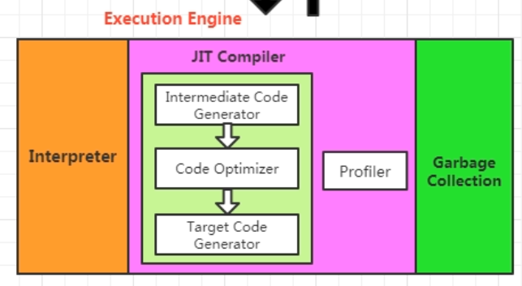
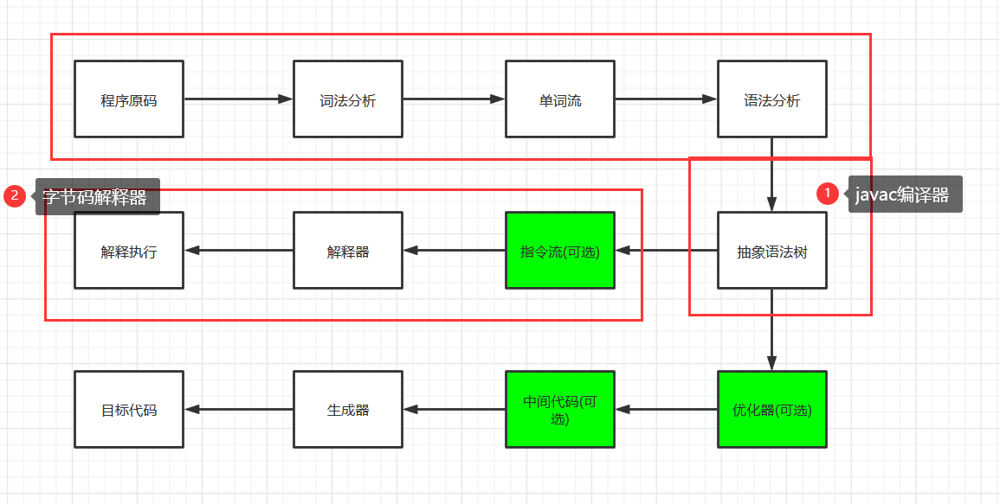
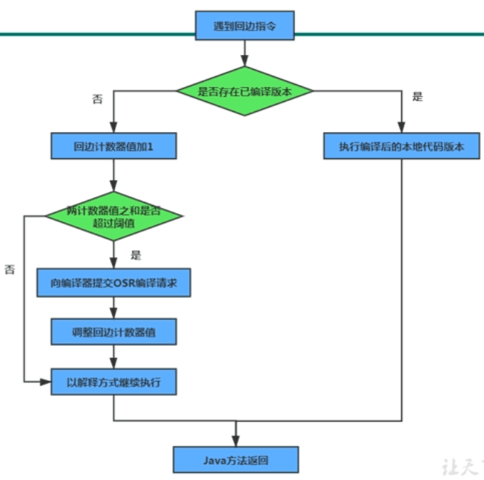

[toc]

## 虚拟机字节码执行引擎

### 执行引擎

**执行引擎将字节码指令解释/编译为对应OS上的的机器指令**

> hotspot执行引擎结构图

#### 解释执行与编译执行

Java虚拟机执行引擎在执行Java代码时,会有两种选择:==解释执行和编译执行==

- 解释执行:通过**字节码解释器把字节码解析为机器语言**执行
- 编译执行:通过**即时编译器产生本地代码**执行

Class文件中的代码到底是解释执行还是编译执行只有Java虚拟机自己才能判断准确

> 编译过程

经典编译原理: **1.对源码进行词法,语法分析处理 2.把源码转换为抽象语法树**

**javac编译器完成了对源码进行词法,语法分析处理为抽象语法树,再遍历抽象语法树生成线性字节码指令流的过程**

剩下的指令流

1. 由虚拟机内部的字节码解释器去将字节码指令进行逐行解释  (解释执行)

2. 或优化器(即时编译器)优化代码最后生成目标代码  (编译执行)

> 执行引擎流程图

#### 解释器与编译器

##### 解释器

- **作用: 对字节码指令逐行解释**

- 字节码解释器: 古老的,纯软件代码模拟字节码执行
- 模板解释器: 把每条字节码指令与模板函数关联
- 优点: 程序启动,解释器立即解释执行
- 缺点: 低效

##### 即时编译器

(just in time compiler)

- Java中的"编译期"不确定

	- 可能说的是执行javac指令时的前端编译器 (.java->.class)

	- 也可能是后端编译器JIT (字节指令->机器指令)
	- 还可能是AOT编译器(静态提前编译器)  (.java->机器指令)

- **作用: 将方法编译成机器码缓存到方法区,每次调用该方法执行编译后的机器码**

- 优点: 即时编译器把代码编译成本地机器码,执行效率高,高效

- 缺点: 程序启动时,需要先编译再执行

> 有了高效的JIT为什么还要解释器

hotspot中采用了解释器+JIT

JVM启动时,解释器可以先进行解释执行,而不必等JIT全编译后再执行,提高了响应速度,之后JIT慢慢把越来越多的代码编译为本地机器码,提高执行效率

##### 热点代码与热点探测

JIT编译器并不是编译所有的字节码,JIT编译器只编译热点代码

**热点代码: 被多次调用的方法 或 方法中多次循环的循环体**

**栈上替换(OSR): JIT将方法中的热点代码编译为本地机器指令**

**热点探测功能**决定了被调用多少次的方法能成为热点代码

- hotspot采用**基于计数器的热点探测**

	- **方法调用计数器 : 统计方法调用次数**

	- **回边计数器 : 统计循环体执行循环次数**

		

> 执行引擎具体采用哪种执行方式流程图

#### 执行引擎执行方式

执行引擎执行方式大致分为3种

`-Xint`: 完全采用解释器执行

`-Xcomp`: 完全采用即时编译器执行

`-Xmixed`: 采用解释器 + 即时编译器

- hotspot中有2种JIT编译器
	- Client模式下的C1编译器:简单优化,耗时短
		- C1优化策略:方法内联,去虚拟化,冗余消除
	- Server模式下的C2编译器:深度优化,耗时长
		- C2主要是逃逸分析的优化:标量替换,锁消除,栈上分配

**分层编译策略: 程序解释执行(不开启逃逸分析)可以触发C1编译,开启逃逸分析可以触发C2编译**

#### 基于栈的指令集与基于寄存器的指令集

javac编译出的字节码指令流是基于栈的指令集架构,与之对应的是PC机中物理硬件支持的指令集架构,依赖寄存器(基于寄存器的指令集)

> 基于寄存器的指令集

指令带参数,依赖寄存器来访问与存储数据

> 基于栈的指令集

指令通常不带参数,依赖栈,在栈中进行操作,结果也存储在操作栈中(也可能保存到局部变量表中)

优点:

1. 字节码指令紧凑(每个字节对应一个指令还不用带参数,基于寄存器的指令集需要带参数)
2. 实现简单(不用考虑分配内存问题,因为操作都是在栈中)
3. 可移植性

缺点: 因为实现同功能指令会比基于寄存器指令多,频繁的对栈进行操作(栈实现在内存中,实际上就是对内存进行操作)会影响速度

> 栈顶缓存 ToS (Top-of-Stack Cashing)

虚拟机使用的这种基于栈式的指令集,相对于基于寄存器的指令集来说,使用零地址指令更加紧凑,但是执行相同的任务(调用某个方法)会带来更多的入栈出栈操作,从而频繁读写内存,影响执行速度

**使用栈顶缓存技术,将栈顶元素全缓存在物理CPU寄存器中,以此降低对内存读写,提升效率**

