[toc]

## 垃圾收集器与内存分配策略

垃圾收集(Garbage Collection)

哪些内存需要收集?

什么时候收集?

怎么收集?

### 分析GC日志

`-XX:+PrintGCDetails` 输出GC详细日志

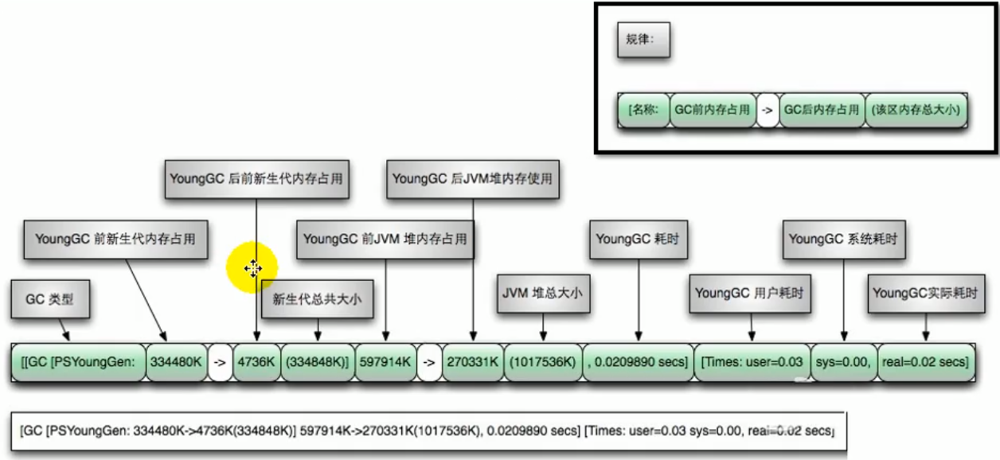

> 使用GC日志分析工具GCeasy

`-Xloggc:./logs/gc.log` 把日志文件输出到当前项目下logs包中的gc.log

生成日志文件后,放到GCeasy官网解析 https://gceasy.io/

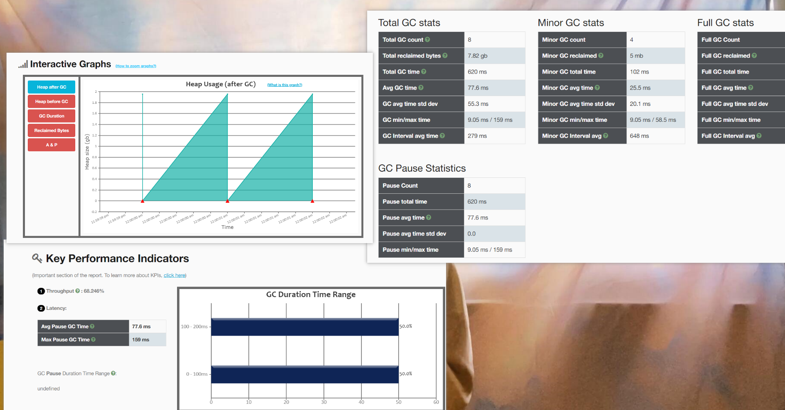

### GC分类与性能指标

#### GC分类

- 同时执行的GC线程数分类

	- 串行垃圾回收器

	- 并行垃圾回收器

		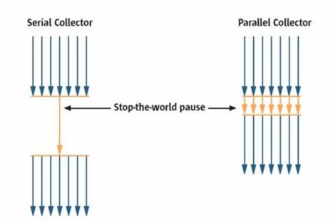

- 工作模式分类

	- 独占式垃圾回收器

	- 并发式垃圾回收器

		

- 内存碎片处理分类

	- 压缩式垃圾回收器 (对内存进行压缩整理,无碎片内存)
	- 非压缩式垃圾回收器

- 工作内存区间分类

	- 新生代垃圾回收器
	- 老年代垃圾回收器

#### 性能指标

主要有吞吐量和延迟

**吞吐量: CPU处理用户代码时间/总时间(垃圾收集时间+处理用户代码时间) **

**延迟: STW暂停用户线程的时间**

尽量追求**高吞吐量和低延迟**

高吞吐量表示程序运行快,低延迟在交互程序中给用户带来好的响应

> 吞吐量和延迟冲突

以高吞吐量为优先,就要减少GC频率,这样会导致GC需要更长的时间,从而导致延迟升高

以低延迟为优先,为了降低每次GC暂停更短的时间,只能增大GC频率,这样导致吞吐量降低

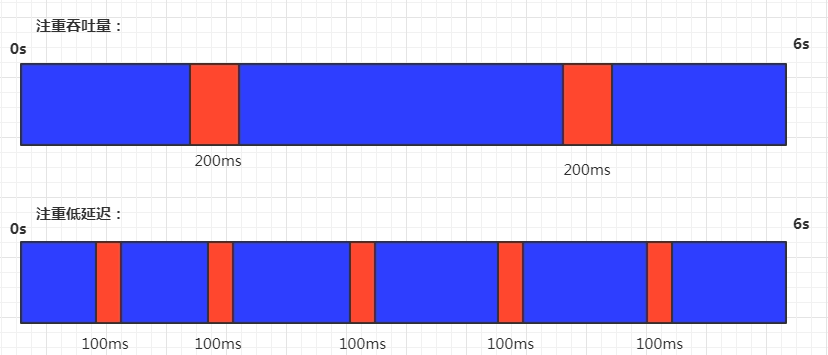

- 现在的目标
	- 在最大吞吐量优先情况下,尽量降低停顿时间
	- 在可以接收的停顿时间中,尽量增大吞吐量

### 经典垃圾收集器

- 串行垃圾收集器: `Serial` , `Serial Old`
- 并行垃圾收集器: `ParNew` , `Parallel Scavenge` , `Parallel Old`
- 并发垃圾收集器: `G1` , `CMS`

- 低延迟垃圾收集器: `ZGC`, `Shenandoah`

> 用户线程停顿与吞吐量

**用户线程停顿时间越短就说明响应给用户会快,提升用户体验**

**吞吐量越高说明最高效率利用处理器资源完成程序**

> 查看JDK8使用的垃圾收集器

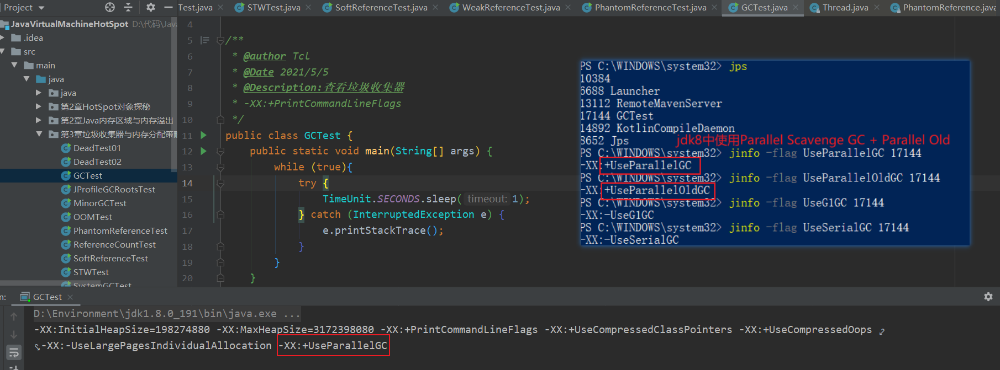

#### Serial收集器和Serial Old收集器

新生代: Serial收集器 **复制算法**

老年代: Serial Old收集器 **标记-整理算法**

> (新生代)Serial收集器 + (老年代)Serial Old 收集器 运行图

若不是频繁回收,停顿时间客户端模式下的用户完全可以接受

**默认Client模式的收集器,适合单核CPU**

适合桌面应用场景(嵌入式),不适合交互的应用(Web)

**串行收集器(单线程) 简单高效(在单线程中) 内存开销最小**

**收集过程中,必须暂停其他所有工作线程,直到它收集结束**

> 参数设置

**`-XX:+UseSerialGC` :新生代使用Serial GC 老年代使用 Serial Old GC**

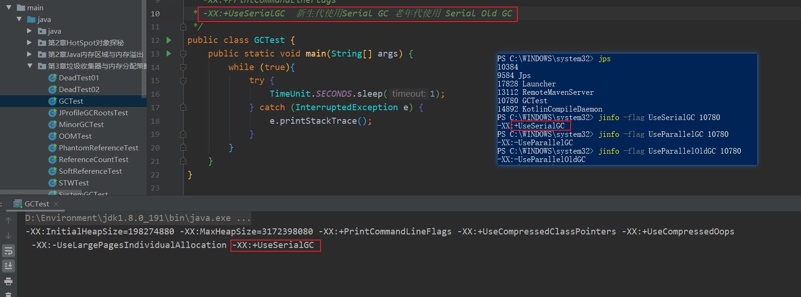

#### ParNew收集器

并行收集器,新生代收集器 

ParNew是Serial新生代的并行版本 **新生代: 复制算法**

第一款并发收集器: 首次实现了让用户线程和GC线程基本上同时工作

> (新生代)ParNew收集器 + (老年代)Serial Old收集器 运行图

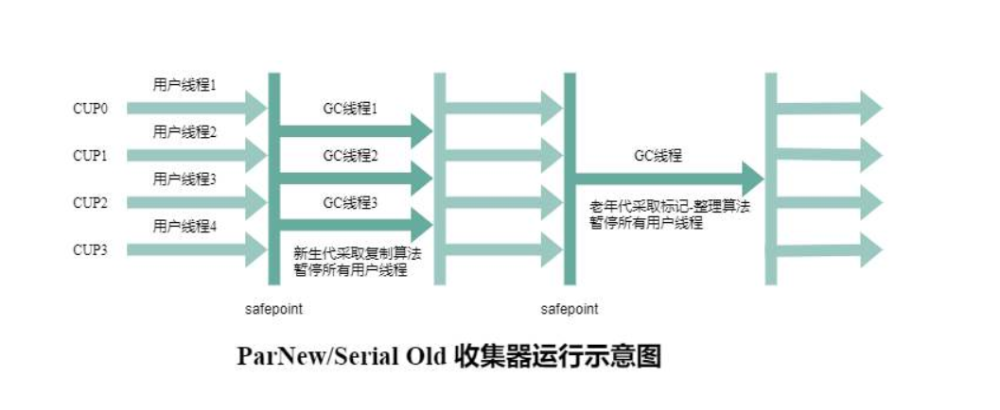

 单核时Serial比ParNew高效

> 参数设置

`-XX:+UseParNewGC`新生代使用ParNew

`-XX:ParallelGCThreads=线程数`

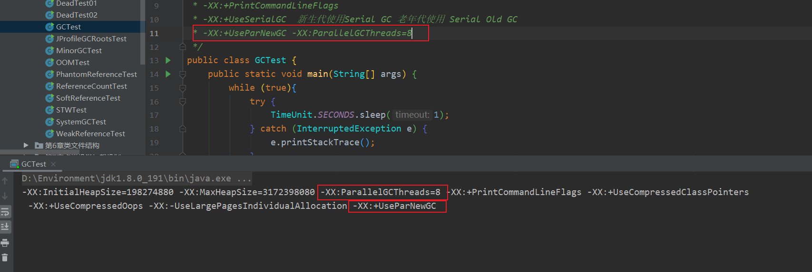

#### Parallel Scavenge收集器 和 Parallel Old收集器

Parallel Scavenge俗称==**吞吐量优先收集器**==并行收集器

**新生代收集器  复制算法**

Parallel Old 是Parallel Scavenge 的**老年代版本 标记-整理算法**

> Parallel Scavenge收集器 + Parallel Old收集器运行图

与ParNew的不同:**精确控制吞吐量,自适应调节策略**

**吞吐量越高说明最高效率利用处理器资源完成程序**

> 参数设置

- `-XX:UseParallelGC` 或 `-XX:UseParallelOldGC`互相激活
	- 新生代使用ParallelGC 老年代使用Parallel Old GC

- `-XX:MaxGCPauseMillis`
	- 最大垃圾收集停顿时间

- `-XX:GCTimeRatio`
	- 直接设置吞吐量大小来精确控制

- `-XX:+UseAdaptiveSizePolicy`
	- **自适应调节策略** 默认开启
	- 开启JVM会根据系统运行情况动态的调整以上2个参数来提高最合适的停顿时间或最大的吞吐量

#### CMS收集器

全称: Concurrent Mark Sweep 并发标记清除收集器

**老年代收集器,采用标记-清除算法**

以**最短停顿时间(低延迟)为目标**的收集器

**多数应用于互联网网站或浏览器的B/S系统,极短的停顿时间可以给用户非常好的体验**

> 执行步骤

1. 初始标记: **标记GC Roots直接关联的对象(STW时间极短)**
2. 并发标记: **从GC Roots直接关联对象开始遍历整个引用链的过程(耗时长,不需要停顿用户线程,用户线程与GC线程并发执行)**
3. 重新标记: **使用增量更新避免对象消失问题,修正并发标记期间改动的对象(需要STW,耗时比步骤1长,比步骤2短)**
4. 并发清除: **清理标记阶段判断已死亡的对象,该阶段也是并发执行**

(不懂增量更新,可以去垃圾回收算法这篇笔记中查找垃圾回收算法的细节)

> CMS执行图

- 优点: 

	1. 停顿时间短(初始标记,重新标记)
	2. 时间长的并发标记和并发清理与用户线程并发执行,加快响应速度,提升用户体验

- 缺点: 

	1. 吞吐量降低

		在处理器核数少时,GC线程与用户线程并发执行(使用i-CMS解决:减少GC线程独占时间,垃圾回收时间变长,对用户线程执行影响变小)

	2. 无法处理浮动垃圾

	  浮动垃圾: 在并发标记阶段产生的新垃圾,不能在这一次的GC中被回收,只能下一次GC时被回收

	  CMS不能等老年代满了再垃圾回收,因为与用户线程并发执行,所以需要留一部分内存

	3. 内存碎片多
	
		(解决: 多次垃圾回收后进行一次标记-整理算法,采用替补方案Serial Old)

> CMS会产生碎片,那为什么不直接采用标记整理算法(而是使用标记清除)

CMS中GC清理垃圾的线程与用户线程会并发执行,如果采用标记整理会改变对象引用地址,此时用户线程也在执行,可能发生严重的错误

> 参数设置

- `-XX:UseConcMarkSweepGC`
	
	- 老年代使用CMS垃圾收集器,新生代使用ParNew收集器
- `-XX:CMSInitiatingOccu-pancyFraction`
	- 设置老年代使用多少空间时开始垃圾回收
		- 如果设置的太高,不够内存分配,不能满足并发执行,就会冻结用户线程启动Serial Old收集器,停顿时间就会变长
		- 如果内存增长缓慢可以设置高一些,如果内存增长很快就要设置低一些 默认92%

- `-XX:+UseCMSCompactAtFullCollection`

	- 指定在FULL GC后是否对内存进行压缩整理
	- 开启后,通过`-XX:CMSFullGCsBeforeCompaction`设置执行多少次FULL GC后进行内存压缩整理

- `-XX:ParallelCMSThreads` 

	- 设置CMS线程数量

	

#### G1收集器

全称 Garbage First 面向服务端的垃圾收集器

**目的: 在延迟可控的情况下尽可能高的吞吐量**

**面向堆内存任何部分来组成区(Region)进行收集,不再分代,哪块内存垃圾最多,收益最大,就回收哪块**

**整体上: 标记-整理算法**

**局部上(区域间): 复制算法**

把Java堆内存分为多个大小相等的区域(Region)

区域的3种情况

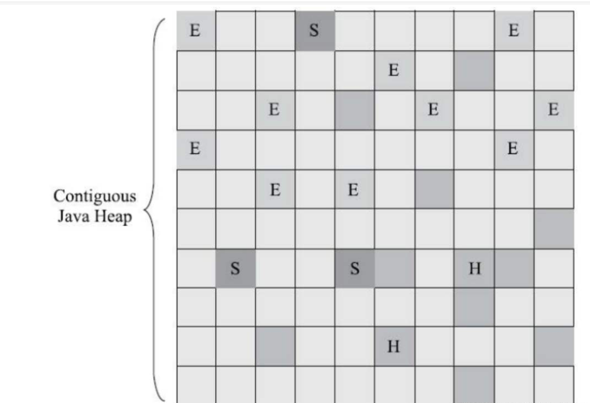

1. 新生代Eden
2. 新生代Survive
3. Humongous区 ==用于存放大对象==(如果一个Humongous不够存放大对象,就把这个大对象存放在连续的多个Humongous上) **大多数情况下把Humongous当作老年代来看**

**G1收集器在后台维护一个优先级队列,跟踪各个区域中的垃圾回收价值(回收垃圾的大小和回收时间的情况),每次通过(`-XX:MaxGCPauseMillis`)用户规定的收集停顿时间来优先回收垃圾回收价值最大的区域**

每个区域设计2个**TAMS(Top at Mark Start)指针,把区域中一部分空间划分出来用来为新对象分配内存(指针碰撞,因为内存规整)** 

(不懂原始快照,可以去垃圾回收算法这篇笔记中查找垃圾回收算法的细节)

**采用原始快照来解决GC线程与用户线程并发时的对象消失问题**

> 执行过程

1. 初始标记 : **标记GC Roots能直接关联的对象,修改TAMS指针(停顿用户线程,耗时短)**
2. 并发标记 :  **从GC Roots直接关联对象开始遍历整个引用链的过程(GC线程与用户线程并发指向,耗时长),扫描完还要处理原始快照记录在并发时有引用变动的对象**
3. 最终标记 : **处理并发阶段遗留下来的少量原始快照记录(停顿用户线程,耗时短)**
4. 筛选回收 : **更新区域的垃圾回收价值,把各个区域的垃圾回收价值(要算成本:回收时间)在优先级队列中排序,根据用户所期望的停顿时间制定回收计划,把要回收的那片区域存活的对象复制到空区域中(复制对象要暂停用户线程,GC线程并发执行)**

如果期望停顿时间设置太短(不符合实际),由于停顿时间短,回收垃圾速度<为新对象分配内存速度,会导致堆满Full GC反而会降低性能

> G1执行图 (图中最终标记是GC并行)

> 参数 (前三个常用)

`-XX:+UseG1GC` 使用G1收集器

`-XX:G1HeapRegionSize`设置每个region大小

`-XX:MaxGCPauseMillis`设置预期停顿时间 (默认200ms,最好不要太小)

`-XX:ParallelGCThread`设置STW时GC线程数

`-XX:ConcGCThreads`设置并发标记线程数

`-XX:InitiatingHeapOccupancyPercent`设置触发老年代GC的堆占用率阈值

> 总结

- 优点:
	1. **整体:标记-整理,局部:复制,不会产生内存碎片**
	2. **从用户期望时间来回收垃圾价值最高的垃圾**
	3. **原始快照的好处(不需要添加新引用记录): 减少并发标记,重新标记阶段的消耗**

- 缺点:

	1. 因为有很多区域,跨区域引用对象问题频繁出现,每个区域要维护记忆集(Key:别的区域地址 Value:集合存储卡表的索引号),卡表实现复杂(其他卡表:我指向谁,这里的卡表:我指向谁+谁指向我),所以**占用内存更大**

	2. **执行负载大(写屏障操作复杂)**

		写后屏障维护复杂的卡表

		原始快照的坏处(需要记录旧引用):写前屏障跟踪并发指针变化,在用户程序运行中产生有跟踪引用变化带来的额外负担

		CMS写屏障可以直接同步,而G1写屏障太复杂要把写前屏障和写后屏障中做的事放到队列中,异步处理

- 适用场景
	
	- 大内存,多处理器的机器,面向服务端

#### 总结

### 低延迟垃圾收集器

衡量垃圾收集器的三个标准: **内存占用,吞吐量,延迟**

随着硬件的提高,吞吐量会增大,堆内存也会增大,堆内存增大代表着收集器收集时间变长,延迟也会变长

##### Shenandoah收集器

###### 执行过程

Shenandoah也是一个基于Region区域的堆内存布局,默认也是回收价值最大的区域

> Shenandoah与G1的区别

1. G1回收阶段,GC线程与用户线程不能并发执行; 而Shenandoah在回收阶段可以

2. G1采用分代收集 ; Shenandoah不采用分代收集

3. Shenandoah没采用G1中解决跨代指针问题的复杂的记忆集,而是采用**连接矩阵**来记录跨区域指针问题,即降低了维护记忆集的消耗也降低了伪共享问题发生的概率

	连接矩阵示意图:

> Shenandoah收集器执行详细步骤

1. 初始标记 : **标记与GC Roots对象关联的直接对象(短暂停顿)**

2. 并发标记 :  **从GC Roots直接关联对象开始遍历整个引用链的过程(GC线程与用户线程并发执行,耗时长)**

3. 最终标记 :  **处理原始快照剩余的记录,统计出回收价值最高的区域,构成回收集(短暂停顿)**

4. 并发清理 : **清理直接垃圾区域(也就是一个存活对象都没有的区域)**

5. 并发回收 : **把回收集里的存活对象移动到未被使用的区域中(GC线程与用户线程并发执行)**

	对象移动后,整个内存中指向对象的引用还是旧对象的地址,很难一瞬间改变,以往的垃圾收集器就是这一步骤不能并发执行的,但是Shenandoah采用==读屏障,转发指针==来解决这个问题

6. 初始引用更新: **确保所有的GC线程完成分配给它们的移动任务,可以开始引用更新(短暂停顿)**

	引用更新: 把内存中所有指向这些存活旧对象的指针修正为新地址

7. 并发引用更新:  **按照物理地址顺序,线性搜索出引用类型,把旧地址改为新地址(时间长短与要修改的引用有关)**

8. 最终引用更新: **修正存在于GC Roots的引用(短暂停顿)**

9. 并发清理 : **经过并发标记,并发引用更新后,整个回收集没有存活对象,并发清理回收集的区域**

> Shenandoah 收集器执行图

Shenandoah收集器执行步骤大致分为:并发标记->并发引用更新->并发清理

###### 转发指针与读屏障

对象移动后,整个内存中指向对象的引用还是对象的旧地址,很难一瞬间改变

如果GC线程一边移动对象,用户线程一边访问,可能会导致用户线程访问到一个旧地址

解决对象移动与用户程序并发执行的2中方案: 内存保护陷阱,转发指针

> 内存保护陷阱

在被移动对象原有内存上设置保护陷阱,一旦用户线程访问到旧对象的内存空间就会自陷中毁.进入预设好的异常处理器,再有代码逻辑把访问转发到移动后的新对象上 **没有操作系统的支持,会频繁的用户态切换到核心态,开销非常大**

> 转发指针

**在原有对象头结构上增加一个新引用字段,在正常情况下指向自己,在并发移动情况下指向新对象**

类似句柄,只不过句柄统一存在句柄池,而转发指针是在对象头上

正常情况下:

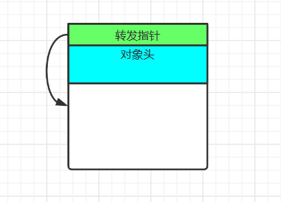

并发移动情况下:

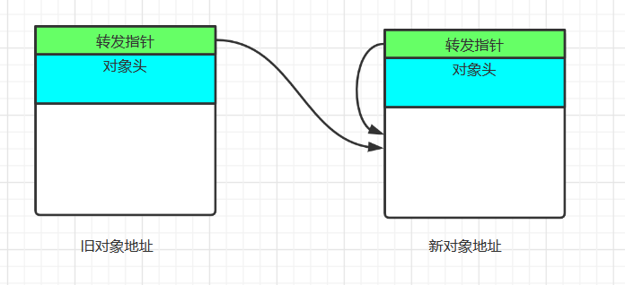

事件1: GC线程复制新对象的副本(准备把这个副本赋值给旧对象的转发指针)

事件2:用户线程对对象进行写操作(更新对象的某个字段)

事件3:GC线程更新转发指针的引用值为新副本地址

如果事件2在事件1,3之间发生,那么就对旧对象进行写操作了,十分危险

所以要对旧对象的转发指针访问进行同步操作,Shenandoah收集器使用CAS操作来保证这里的原子性

**转发指针保证了并发时对对象的正确访问性**

要覆盖全部对象访问操作,Shenandoah需要设置读屏障去拦截

读屏障的设置带来很大的性能开销

###### 总结

Shenandoah是基于Region区域的堆内存布局,默认回收价值最大的区域,无分代,使用转发指针,读写屏障等技术并发执行标记-整理算法的低延迟垃圾收集器

- 优点: 低延迟
- 缺点: 高运行负负担使得吞吐量下降,运行时间变长

##### ZGC收集器

ZGC收集器是一款基于Region内存布局的,不设分代的,使用读屏障,染色指针,内存多重映射等技术来实现并发执行标记-整理算法的低延迟垃圾收集器

###### 内存布局

ZGC也是基于Region(Page,ZPage)区域的堆内存布局,无分代

**ZGC的区域具有动态性,动态创建,销毁,以及动态的区域容量大小**

- 小型Region 容量固定2MB,存放的 Object<258KB

- 中型Region 容量固定32MB,存放的 258KB<=Object<4MB

- 大型Region 容量不固定,可以动态变化,为2MB的整倍 存放的 Object>4MB

	**大型Region只能分配一个大对象(所以大型Region可能比中型Region小),大型Region不会被重分配(执行过程的动作,后面介绍)**

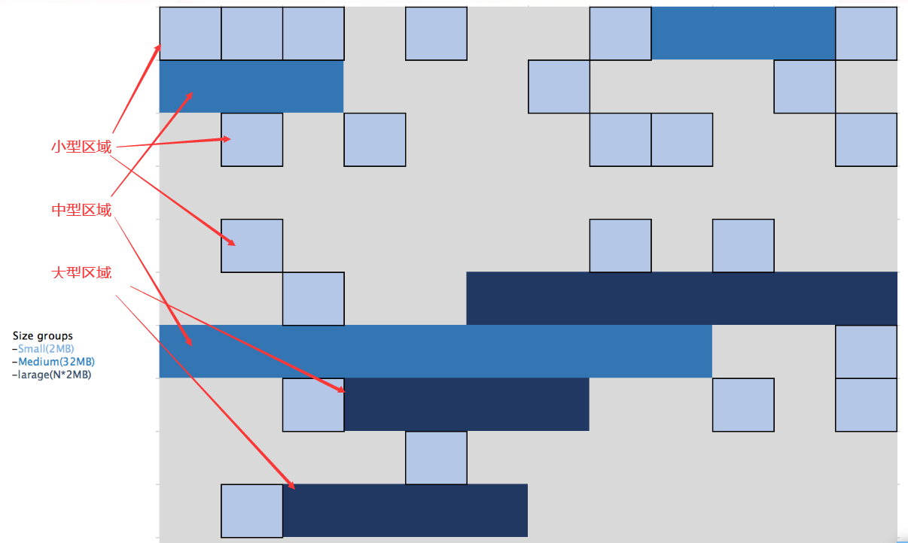

###### 染色指针

某个对象只有它的引用关系能决定它的存活,它的属性都不能影响它的存活判定

标记的实现方案:

1. 标记在对象头(Serial收集器)
2. 标记在独立的数据结构上(G1,Shenandoah收集器)
3. ZGC采用染色指针,直接把标记信息记录在引用对象的指针上

**染色指针是一种直接将少量额外信息存储在指针上的技术**

Linux下64位指针高18位不能寻址,染色指针把低46位中的高4位提取出来,存储标志信息

通过染色指针上的标志,虚拟机就可以直接从指针中看到**引用对象的三色标记状态**,**是否进入了重分配集**,**是否只能通过finalize()方法才能被访问到**

因为染色指针,所以ZGC收集器只存在于Linux下

> 染色指针的优点

1. 一旦某个区域的存活对象移动走后,这个区域就可以被释放和重用 (不用等待更新引用再清理)
2. 大幅减少垃圾收集过程中内存屏障的使用数量(无分代,不用解决跨区域的指针问题,省去一部分内存屏障,没有了这部分的开销,所以ZGC的吞吐量也不低)
3. 染色指针作为可扩展的存储结构,用来记录更多对象标记,重定位过程相关数据

###### 多重映射

因为JVM被当作一个进程.处理器只会把整个指针当作一个内存地址来对待

要解决这个问题需要虚拟映射技术

Linux上的**ZGC采用多重映射将多个不同的虚拟内存地址同时映射到同一个物理地址, 多对一的映射关系**

**把染色指针上的标志位看成地址分段符,将这些不同的地址段都映射到同一个物理内存,经过多重映射后,染色指针就可以正常寻址了**

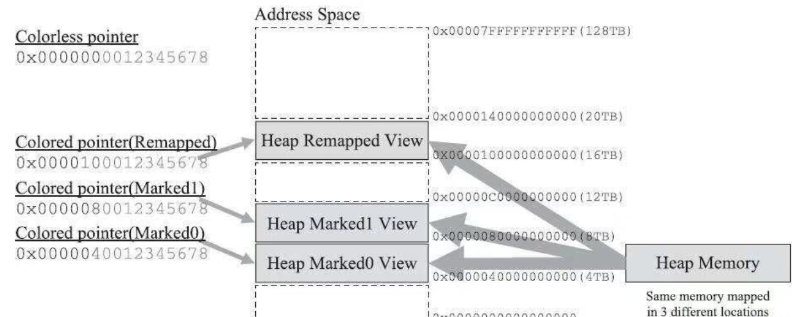

###### 执行过程

> ZGC大致的执行过程

1. 并发标记 : (在该阶段前后还有初始标记,终止标记,这里省略)**从GC Roots直接关联对象开始遍历整个引用链的过程,标记阶段更新染色指针上的Marked0,Marked1标记位**

2. 并发预备重分配 : **根据特定的查询条件统计出来本次收集过程中需要清理的区域,将这些区域组成重分配集**

	重分配集不是回收集,ZGC每次回收会扫描所有的区域,使用范围更大的扫描成本换取G1中维护记忆集的成本

	**重分配集:只决定了哪些区域的存活对象会被重新复制到其他区域中,重分配集中的区域会被释放**

3. 并发重分配 : **把重分配集中存活的对象复制到新的区域上,并为每个重分配集的区域维护一个转发表:记录旧对象到新对象的转向关系**

	**指针的自愈: ZGC收集器只从引用上就可以直到这个对象是否处于重分配集中,如果用户线程并发访问重分配集中的对象,此次访问会被内存屏障拦截,然后立即根据转发表记录,将此次访问改为新对象的地址,并同时修改该引用的值,使其直接指向新对象**

	ZGC只访问1次旧对象就能修正,而Shenandoah转发指针只有等并发更新引用完成才修正(这期间可能进行多次访问,开销比ZGC大)

4. 并发重映射: **修正整个重分配集中旧对象的引用,因为有转发表所以不用迫切进行,可以合并到下次垃圾回收的并发标记阶段顺便做了,所有指针被修正后,就可以释放转发表**

###### 总结

- 优点:
	1. 低延迟
	2. 吞吐量高

- 缺点:
	1. 分配对象速率慢,如果ZGC应对分配对象速率高,将创建大量对象,新对象很难进入收集标准范围,所以会产生浮动垃圾,如果高速分配对象一直维持的话,剩余空间就越来越小了

### 内存分配与回收策略

1. 对象优先在Eden区分配

2. 大对象可以直接分配到老年代

	2.1 新生代不够内存存放大对象

	2.2 Serial,ParNew收集器中使用`-XX:PretenureSizeThreshold=?k`可直接让大于这个数的对象进入老年代

3. 长期存活对象进入老年代

	3.1 对象通常在Eden诞生,经过第一次Minor GC后仍然存活,且能被放入Survive区,则标记它的年龄为1,之后每经历一次Minor GC且能存活下来,年龄+1,满足`-XX:MaxTenuringThreshold=?`(默认15)后,将会进入老年代

	3.2 如果在Survive区,年龄小于或等于A年龄的对象占Survive区的一半,那年龄大于或等于A年龄的对象就可以直接进入老年代

4. 空间分配担保

	发生Minor GC前,JVM会检查老年代最大连续可用空间是否大于新生代所有对象总空间,如果大于,那这次Minor GC就是安全的,如果不大于就会先看看是否允许担保失败

	`-XX:HandlePromotionFailure`是否允许担保失败

	​		如果允许,会检查老年代最大连续可用空间是否大于历届晋升到老年代对象的平均大小

	​				如果大于则进行有危险的Minor GC(有可能这次晋升到老年代的对象比以往多得多,以至于老年代最大连续可用空间不够,这样就担保失败了,还是会发生Full GC)

	​				如果小于或`-XX:HandlePromotionFailure`不允许担保失败,则直接进行Full  GC

	在JDK6 update24后,`-XX:HandlePromotionFailure`没用了,**默认: 只要老年代最大连续可用空间大于新生代所有对象或历届升到老年代的平均大小就进行Minor GC,否则进行 Full GC**

	

### 回收方法区

方法区的垃圾回收主要有两部分: ==不使用的常量和类==

回收方法区性价比比较低,因为不使用的常量和类比较少

> 不使用的常量

**没有任何地方引用常量池中的某常量**,则该常量会在垃圾回收时,被收集器回收

> 不使用的类

成为不使用的类需要满足以下要求:

1. **没有该类的任何实例对象**
2. **加载该类的类加载器被回收**
3. **该类对应的Class对象没在任何地方被引用**

