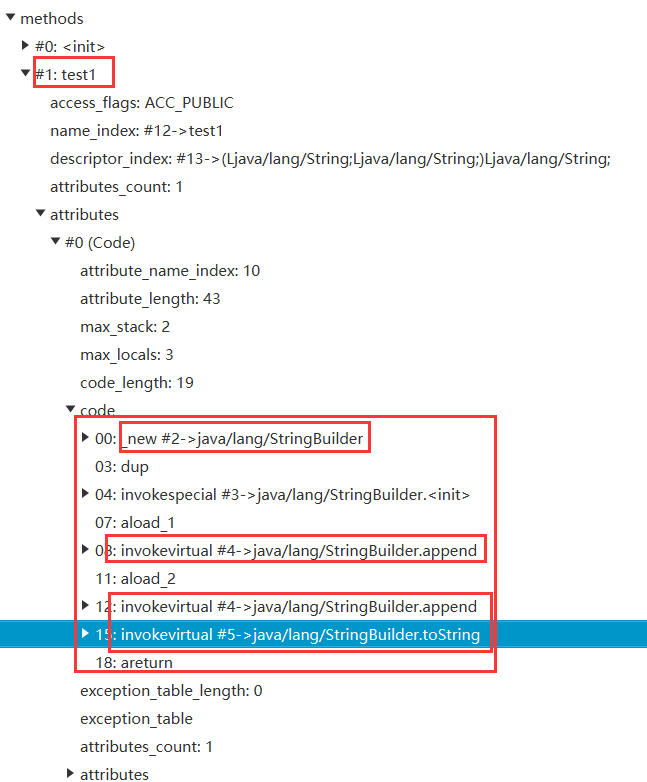
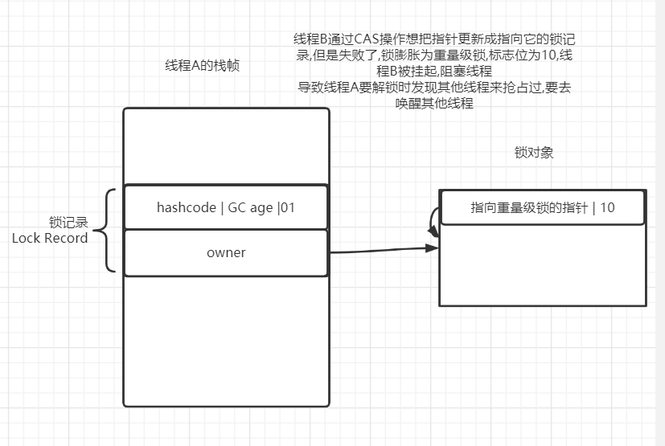
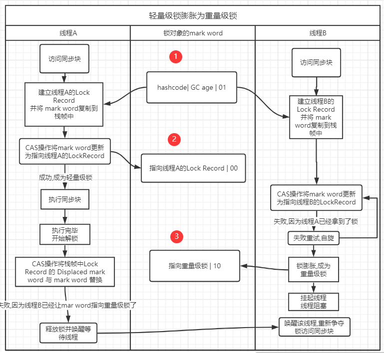
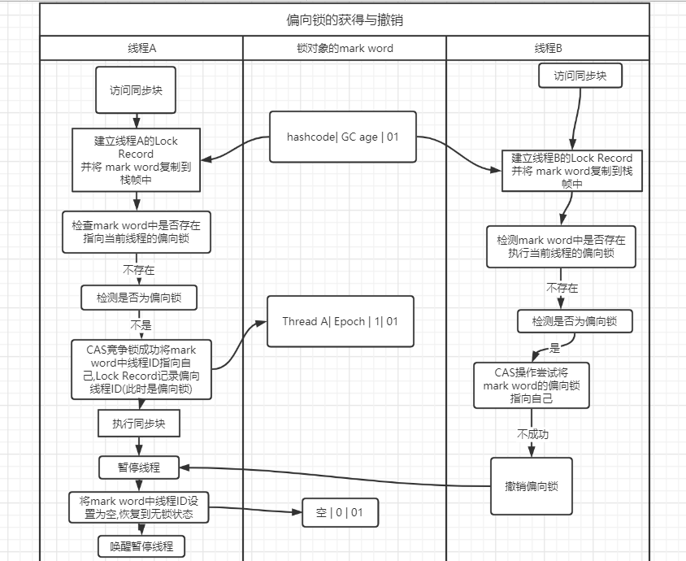

[toc]


## 线程安全与锁优化

### Java线程安全

不把线程安全当作一个非真即假的选项,从线程安全的程度上由强到弱可以排序为: ==不可变,绝对线程安全,相对线程安全,线程兼容,线程对立==


#### 不可变

**不可变的对象一定是线程安全的**

因为不可变在多线程中不可以修改,因此不可变对象在外部的可见状态不会变

**基本类型可以使用final来保证它不可变**

**引用类型自行保证不会对其状态发生改变,参考(String,Integer等类,将内部状态变量设置为final)**


#### 绝对线程安全

**不管运行环境如何,调用者都不需要任何额外的同步措施**

定义非常严格,要实现的成本很高,包括Java API中标注自己是同步的类大多数都不是绝对线程安全的

```java
	public static void test1(){
        Vector<Integer> vector = new Vector<Integer>();

        while (true){
            for (int i = 0; i < 10; i++) {
                vector.add(i);
            }

            new Thread(()->{
                for (int i = 0; i <vector.size() ; i++) {
                    vector.remove(i);
                }
            },"删除元素线程").start();

            new Thread(()->{
                for (int i = 0; i < vector.size(); i++) {
                    System.out.print(vector.get(i));
                }
            },"打印元素线程").start();
			//不产生过多线程,防止OS假死
            while (Thread.activeCount() > 20) {};
        }
    }
```


有可能打印元素线程要读下标i,此时删除元素线程已经把下标i删除了,导致出现数组下标越界异常

虽然Vector的add,remove,get方法都同步,但如果不在方法调用者做同步措施,依旧是线程不安全的

若想线程安全需要给方法调用者增加同步措施

```java
	public static void test2(){
        Vector<Integer> vector = new Vector<Integer>();

        while (true){
            for (int i = 0; i < 10; i++) {
                vector.add(i);
            }

            new Thread(()->{
                synchronized (vector){
                    for (int i = 0; i <vector.size() ; i++) {
                        vector.remove(i);
                    }
                }
            },"删除元素线程").start();

            new Thread(()->{
                synchronized (vector){
                    for (int i = 0; i < vector.size(); i++) {
                        System.out.print(vector.get(i));
                    }
                }
            },"打印元素线程").start();

            while (Thread.activeCount() > 20) {};
        }
    }
```

如果Vector要做到绝对线程安全,需要在内部维护一组一致性的快照访问,每次对元素改动产生快照,成本非常大


#### 相对线程安全

**保证对这个对象单次的操作是线程安全的,我们在调用时不用进行额外保障措施**

大部分声称线程安全的类:Vector,HashTable,Collections.synchonizedCollection()等都是相对线程安全


#### 线程兼容

**对象本身并不是线程安全的,但是通过在调用端正确的使用同步手段来保证对象在并发中可以安全使用**

Java API中大部分类都是线程兼容的(也就是线程不安全的,如:LinkedList,ArrayList) 


#### 线程对立

**不管调用端是否采取同步措施,都无法在并发环境中使用**

有害的,需要避免

`Thread.suspend(),Thread.resume()`如果在多线程中,要挂起的线程就是要恢复的线程,就会发生死锁,已经被废弃


### 线程安全的实现方法

#### 互斥同步

最常见,最主要使用的并发手段

同步: 多线程并发访问共享数据时,保证共享数据某时刻只能由一个线程访问

临界区,互斥量(加锁),信号量都是常见的互斥实现方式

Java中的互斥同步手段有:`synchronized`和`JUC下的Lock`

**互斥同步又叫阻塞同步,主要问题是挂起线程和唤醒线程(用户态转为核心态)带来开销大**

**互斥同步是悲观的策略,认为只要不同步就会出现问题,无论共享数据是否发生多线程的竞争都加锁**

##### synchronized

**synchronized是一种块结构得同步语法**

执行synchronized同步块的步骤:

1. synchronized的同步块经过javac编译后会变成`monitorenter,monitorexit`在同步块的前后(==监视器入口和监视器出口==)

	`monitorentry,monitorexit`需要`reference`类型对象来指明要锁定,解锁的对象

2. 如果synchronized指明了参数类型(比如`synchronized(vector){}`),那就对vector进行锁定,解锁

	如果synchronized未指明参数类型,并且sychronized修饰的是实例方法(比如 `public synchronized void test(){}`),那对调用此方法的对象进行锁定,解锁

	如果synchronized未指明参数类型,并且sychronized修饰的是静态方法(比如 `public static synchronized void test(){}`),那对调用此类的Class对象进行锁定,解锁

3. 执行`monitorentry`:尝试获取对象的锁,如果==该对象未被锁定==或者==该线程已经有了该对象的锁== 则锁的计数器值+1  **如果获取锁失败则阻塞等待,直到拿到该对象的锁为止(等待其他线程释放锁)**

4.  执行`monitorexit`: 把该对象的锁的计数器值-1,计数器值未0时,对象的锁被释放

通过以上步骤可以知道:

- synchronized修饰的同步块是可重入的==同一线程可以反复进入同步块,不会自己把自己锁死==
- synchronized无条件阻塞其他线程,无法中断其他线程得等待,无法强制以获得锁得线程释放锁

synchronized是重量级的操作,因为Java线程对应操作系统原生线程,阻塞时会挂起线程和唤醒线程,需要用户态转到核心态,非常消耗资源,如果同步代码执行时间非常短,可能会导致转换形态的时间比执行同步代码还长


##### Lock

JUC下的Lock接口提供非块结构实现互斥同步

ReentrantLock是Lock的常见实现

> ReentrantLock比sychronized增加的功能

1. 等待可中断: **当持有锁线程长期不释放锁时,正在等待的线程可以选择放弃等待**

2. 公平锁: **ReentrantLock默认是非公平锁,可以通过构造`new ReentrantLock(true)`实现公平锁**

3. 锁绑定多个条件: **一个ReentrantLock可以绑定多个Condition对象(多线程交替执行)**

	Condition监控器精准唤醒

	```java
	/**
	 * @author Tc.l
	 * @Date 2020/10/31
	 * @Description: 多线程交替执行
	 */
	public class ReplaceExecute {
	    public static void main(String[] args) {
	        Execute execute = new Execute();
	        new Thread(()->{
	            for (int i = 0; i < 5; i++) {
	                execute.ExecuteA();
	            }
	        },"A线程").start();
	
	        new Thread(()->{
	            for (int i = 0; i < 5; i++) {
	                execute.ExecuteB();
	            }
	        },"B线程").start();
	
	
	        new Thread(()->{
	            for (int i = 0; i < 5; i++) {
	                execute.ExecuteC();
	            }
	        },"C线程").start();
	    }
	}
	
	class Execute {
	    private Lock lock = new ReentrantLock();
	    //conditionA,B,C分别监控线程A,B,C
	    private Condition conditionA = lock.newCondition();
	    private Condition conditionB = lock.newCondition();
	    private Condition conditionC = lock.newCondition();
	    private String s = "A";
	
	    public void ExecuteA() {
	        lock.lock();
	        try {
	            while (!Objects.equals(s,"A")){
	                conditionA.await();
	            }
	            System.out.println(Thread.currentThread().getName()+"=>AAAAAAAAAA");
	
	            //唤醒下一个监视器
	            s = "B";
	            conditionB.signal();
	        } catch (Exception e) {
	            e.printStackTrace();
	        } finally {
	            lock.unlock();
	        }
	    }
	
	    public void ExecuteB() {
	        lock.lock();
	        try {
	            while (!Objects.equals(s,"B")){
	                conditionB.await();
	            }
	            System.out.println(Thread.currentThread().getName()+"=>BBBBBBBBB");
	
	            //唤醒下一个监视器
	            s = "C";
	            conditionC.signal();
	        } catch (Exception e) {
	            e.printStackTrace();
	        } finally {
	            lock.unlock();
	        }
	    }
	
	    public void ExecuteC() {
	        lock.lock();
	        try {
	            while (!Objects.equals(s,"C")){
	                conditionC.await();
	            }
	            System.out.println(Thread.currentThread().getName()+"=>CCCCCCCCCC");
	            //唤醒下一个监视器
	            s = "A";
	            conditionA.signal();
	        } catch (Exception e) {
	            e.printStackTrace();
	        } finally {
	            lock.unlock();
	        }
	    }
	}
	```

	

> ReentranrtLock与synchronized性能对比

- JDK5前

	ReentrantLock在多线程中稳定,synchronized在多线程中性能逐渐下降

- JDK6后(优化synchronized)

	二者基本相同

	

	

	


#### 非阻塞同步

非阻塞同步是一种乐观并发策略,不会把线程阻塞挂起,又叫无锁编程

**不管风险,先执行,如果没其他线程争用共享资源,那就执行成功,如果有其他线程争用共享资源,那就做补救措施(常见的就是失败重试)**

前提: 必须要求操作和冲突检测具有原子性(通过硬件来保证)

Java API中sum.misc,Unsafe类中的本地方法很多都是去执行平台相关CPU原语的CAS操作(比较并交换)

> CAS执行过程

CAS指令有三个操作数: 内存位置(变量内存地址),旧的期望值,新的期望值

执行时,查看内存位置上的值是否是旧的期望值,如果是,则更新为新的期望值,如果不是则不执行更新,无论是否更新了内存位置的值,都会返回该内存位置上旧的值


> CAS的逻辑漏洞--ABA问题

ABA问题: 执行CAS操作时读到的值为A,如果这个过程中线程B把这个值改为B再改为A,比较时仍然是A,那么CAS会觉得值从来没改变过

JUC为这个逻辑漏洞提供了原子引用类`AtomicStampedReference`类似乐观锁版本,不仅要检查值还要检查版本是否正确

大部分情况下的ABA问题不会影响程序并发的正确性,如果要解决ABA问题,互斥同步可能比原子类更高效


- 优点: 不会阻塞(不用花费挂起,唤醒线程,需要用户态转为核心态的开销)

- 缺点: 失败重试(循环)CPU的开销,此时即消耗了CPU又做了无用功,ABA问题,只能保证一个共享变量的原子性


#### 无方案同步

同步与线程安全两者没有必然联系

有些代码天生就是线程安全的

可重入代码和线程本地存储

> 可入代码

**可重入代码:在代码执行任何时刻中断,去执行另一段代码,控制权返回后,程序不会出现任何错误**

可重入代码特征:==不依赖全局变量,堆上数据和公用系统资源,用到的状态量由参数传入(也就是使用局部变量)==


> 线程本地存储

如果有共享数据,先尝试看看共享数据的代码能否在一个线程中完成执行,如果可以就把共享数据可见性限制在同一线程中,防止线程间出现数据争用问题


### 锁优化

#### 自旋锁与自适应自旋

>  自旋锁

互斥同步时,挂起,恢复线程用户态切换为核心态的开销大,如果共享数据状态只持续短时间,为了这段时间去挂起,恢复线程不值得,此时可以使用自旋锁

**自旋锁 :为了让线程不阻塞,只需要让一个线程执行循环(自旋)**

CAS操作+失败重试就是自旋锁

```java
public class SpinLock {
    //原子引用线程 原子引用值默认为null
    AtomicReference<Thread> atomicReference = new AtomicReference<>();

    public static void main(String[] args) {
        SpinLock lock = new SpinLock();
        new Thread(()->{
            lock.MyLock();
            try {
                System.out.println(Thread.currentThread().getName()+"加锁");
                TimeUnit.SECONDS.sleep(3);
            } catch (InterruptedException e) {
                e.printStackTrace();
            }finally {
                lock.MyUnLock();
                System.out.println(Thread.currentThread().getName()+"解锁");
            }
        },"线程A").start();

        new Thread(()->{
            lock.MyLock();
            try {
                System.out.println(Thread.currentThread().getName()+"加锁");
            } finally {
                lock.MyUnLock();
                System.out.println(Thread.currentThread().getName()+"解锁");
            }
        },"线程B").start();
    }

    public void MyLock(){
        Thread thread = Thread.currentThread();

        //自旋 如果原子引用值为空(期望) 就把原子引用值 设置为 当前线程(更新) 退出循环
        while (!atomicReference.compareAndSet(null,thread)){

        }
    }

    public void MyUnLock(){
        Thread thread = Thread.currentThread();
        //解锁: 如果原子引用值是当前线程(期望) 就把原子引用 值设置为空(更新)
        atomicReference.compareAndSet(thread,null);
    }
}
/*
线程A加锁
线程A解锁
线程B加锁
线程B解锁
*/
```

优点: 避免线程切换开销

缺点: 占用CPU

如果锁被占用时间短,自旋效果非常好; 如果锁被占用时间长,白白消耗CPU资源效果不会好,因此自旋等待时间超过一定限度就会按互斥同步挂起线程


> 自适应自旋

**自适应意味着自旋时间不固定,虚拟机会通过前一次在这个锁上自旋时间以及锁的拥有者状态来决定**

**对某个锁,如果很少成功获得过锁,那获取这个锁时会省略自旋,直接挂起,避免浪费CPU资源,如果很多次成功获得锁,就会自旋等待**


#### 锁消除

**锁消除: 虚拟机即时编译器运行时,检测到有一些同步代码不可能出现共享数据竞争时,会忽略掉同步措施直接执行**

```java
public String test1(String s1,String s2){
        return s1+s2;
}
```



JDK8中,实际上它创建了StringBuilder对象,通过这个对象的append方法进行追加字符串,然后用toString方法转为String类型返回

在JDK5前,使用的是StringBuffer,此类的方法被synchronized修饰

在JDK5前,虚拟机即时编译器就会用到锁消除


#### 锁粗化

**一系列的连续操作都对同个对象进行加锁解锁,频繁互斥同步也会有性能消耗,此时会把加锁的范围扩展到整个操作系列的最后一个**


#### 轻量级锁

JDK 6 引入 

设计初衷: **在没有多线程竞争的前提下,减少传统重量级锁使用操作系统互斥量(挂起,恢复线程)产生的性能消耗**

锁状态: 未锁定,轻量级锁定,重量级锁定(锁膨胀),可偏向

> 加锁过程

1. 即将进入同步块时,同步对象状态为未锁定,虚拟机在**当前线程的栈帧中创建==锁记录(Lock Reco):用于存储锁对象的Mark Word副本和这个锁对象==,并把对象头中的mark word记录在锁记录中**

	

2. 虚拟机**使用CAS操作尝试把该对象的对象头的Mark Work更新为指向锁记录的指针**,如果成功说明该线程拥有该对象的锁,此时锁变为轻量级锁,标志位为00

	

3. 如果更新操作失败,说明至少存在一条线程与当前线程竞争该对象的锁.

  先检查该对象的对象头的Mark Word是否指向当前线程的栈帧,如果指向说明当前线程已经有了这个对象的锁,如果没指向说明被其他线程占用(==此时该对象的锁状态变为重量级锁,该对象的对象头Mark Word不再指向锁记录的Displaced Mark Word而是指向重量级锁的指针,后面的线程都需要阻塞==)


> 解锁过程

用CAS操作把对象的Mark Word和线程栈帧中复制的Displaced Mark Work进行替换,如果替换成功,说明没有其他线程来过,如果替换失败,说明有其他线程来过改变了对象Mark Word的指向,释放锁时需要唤醒那个被挂起的线程



> 图像解析轻量级锁膨胀为重量级锁



图中红点1,2,3分别对应着加锁,解锁过程中的图像


**如果同步中不存在竞争,CAS操作避免了使用互斥量的开销,如果同步中存在竞争,不仅有CAS操作的开销还有互斥量的开销**

**竞争情况下,轻量级锁比重量级锁开销还慢**


#### 偏向锁

JDK 6  引入 默认启动(==-XX:+UseBiasedLocking==)

**消除数据在无竞争情况下的同步原语,进一步提高性能**

轻量级锁在无竞争情况下,使用CAS操作替代互斥量;偏向锁在无竞争情况下,连CAS都不做了


偏向锁偏心第一个获得它的线程,如果执行过程中,该锁一直没有其他线程获取,则持有偏向锁的这个线程永远不用再同步了

> 加锁过程

1. 当某个**线程访问同步块并获取到锁时,会在对象头和栈帧中的锁记录中记录锁偏向的这个线程ID**

2. 以后这个线程进入这个锁相关的同步块,只需要检测mark word中是否存在指向当前线程的偏向锁,虚拟机不用再做任何同步操作

	2.1 如果检测成功,说明这个线程已经获得锁

	2.2 如果检测失败,要再检测这个锁对象是否是偏向锁(mark word中偏向标识是否为1)

	​		2.21 如果不是偏向锁,则CAS操作竞争锁

	​		2.22  如果是偏向锁,则尝试用CAS将对象头的偏向锁指向当前线程

	

	

> 偏向锁的撤销

**偏向锁采用只有竞争出现才会释放锁的机制**

偏向锁的撤销需要等到全局安全点(这个时间点上不执行字节码文件)

1. 先暂停拥有偏向锁的线程,检查拥有偏向锁的线程是否存活
2. 如果拥有偏向锁的线程不处于活动状态,将mark word设置为无锁模式
3. 如果拥有偏向锁的线程活着,该线程栈帧中的锁记录和mark word要么偏向其他线程, 要么恢复为无锁,要么标记对象不适合作为偏向锁
4. 唤醒暂停的线程


> 偏向锁的获得与撤销



  

**偏向锁可以提高有同步但无竞争的程序性能,但如果程序大多数锁总被多个不同线程访问,那偏向模式是多余的,有时候禁止偏向锁优化还可以提高性能**